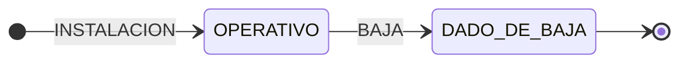
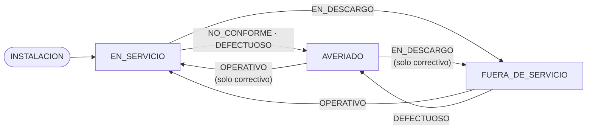

# GMAO Subestaciones — Asistente de Mantenimiento

**🔗 Aplicación desplegada: [final-proyect-gestion-subestaciones.vercel.app](https://gmao-subestaciones.vercel.app)**

Aplicación fullstack para la gestión de activos de subestaciones eléctricas con un agente de IA integrado como parte central del producto. Construida como proyecto final del bootcamp sobre el Mini-GMAO de la fase 1.

## De qué trata

Un **GMAO** (Gestión de Mantenimiento Asistida por Ordenador) para el parque de equipos
de subestaciones eléctricas: transformadores, interruptores, seccionadores, pararrayos…
Los técnicos registran las intervenciones (inspecciones, preventivos, correctivos,
instalaciones y bajas) como **órdenes de trabajo inmutables**, y el sistema mantiene el
estado de cada activo y calcula su **próxima inspección según el intervalo normativo de
cada tipo de equipo**: 90 días los seccionadores, 180 los transformadores de potencia y
baterías de condensadores, 365 el resto (`backend/lib/intervalos-inspeccion.js`,
alineado con el procedimiento PM-01 del corpus RAG). Cada inspección conforme reinicia
el contador; el dashboard señala los vencimientos.

Sobre ese dominio se monta el producto diferencial: un **asistente de IA** que responde
en lenguaje natural tanto sobre el estado real del parque ("¿cuántos activos averiados
hay en la subestación Norte?") como sobre la normativa de mantenimiento aplicable
("¿qué es un descargo?"), citando sus fuentes.

**Naturaleza del sistema — la decisión que lo define**: es un sistema de **registro con
trazabilidad inmutable**, no de gestión de trabajo futuro. Una OT documenta una
intervención ya realizada: nace cerrada, no se edita y no se borra. El historial de un
activo es, por diseño, un hecho histórico auditable.

**El scope**: esta aplicación cubre la **mitad de registro** de un
GMAO. Los mantenimientos no se programan y las incidencias no se notifican como parte de
avería previo al trabajo — solo se registran intervenciones ya realizadas y su efecto en
el equipo. No es una carencia oculta sino la frontera elegida del producto: un GMAO
completo necesitaría un segundo desarrollo con la mitad de **gestión del trabajo**
(parte de incidencias, planificación, ciclo de vida de la orden), que se apoyaría sobre
este registro como cimiento. El detalle, en
[Alcance y limitaciones](#alcance-y-limitaciones-decisiones-conscientes).

---

## Estructura del repositorio

```text
gestion-subestaciones/
├── frontend/          # React + Vite → Vercel
├── backend/           # GMAO Node (dominio, auth, OTs) → Railway
├── ia-service/        # FastAPI + LangGraph (agente IA) → Railway
├── n8n-workflows/     # Workflows exportados como JSON
├── docker-compose.yml # Postgres + Node + Python en local
└── README.md
```

---

## Arquitectura

Dos servicios de backend independientes que no se fusionan:

| Servicio | Tecnología | Responsabilidad |
| --- | --- | --- |
| `backend/` | Node + Express + Prisma | Fuente de verdad del dominio: auth, activos, OTs, subestaciones, máquina de estados, dashboard. Emite los JWT. |
| `ia-service/` | FastAPI + LangGraph | Agente IA, RAG con normativa, endpoints de chat. Valida el JWT de Node; lee el dominio vía API de Node, nunca directo a Postgres. |
| `frontend/` | React 18 + Vite + React Router v6 | CRUD contra Node; chat contra FastAPI. |

**JWT compartido**: Node firma el token en el login (`HS256`, `JWT_SECRET`). FastAPI lo valida con el mismo secreto. Un solo sistema de autenticación para los dos backends.

---

## Tecnologías

| Capa | Stack |
| --- | --- |
| **Frontend** | React 18 · Vite 5 · React Router 6 · Recharts (gráficos) · lucide-react (iconos) · estilos inline + variables CSS |
| **Backend (GMAO)** | Node + Express 4 · Prisma 5 (ORM) · Zod (validación) · JWT (`jsonwebtoken`) · bcryptjs · seguridad: Helmet, CORS, Morgan, express-rate-limit |
| **ia-service** | Python 3.12 + FastAPI · Pydantic v2 · LangChain + **LangGraph** (agente ReAct) · **Groq** (`llama-3.3-70b-versatile`) · ChromaDB + fastembed (RAG) · python-jose (validación JWT) · httpx |
| **Base de datos** | PostgreSQL 16 (dominio en Node vía Prisma; checkpointer del agente vía `langgraph-checkpoint-postgres`) |
| **Automatización** | n8n (webhook + Switch) · Telegram (notificaciones) |
| **Testing** | Vitest + Supertest (170 tests de backend) · newman (colección Postman) |
| **Despliegue** | Vercel (frontend) · Railway (backend, ia-service, Postgres) · n8n Cloud · Docker / docker-compose (Postgres en local) |

---

## Lógica de negocio — la máquina de estados (V2, dos ejes)

El corazón del dominio es una **función pura** (`backend/lib/transiciones.js`, sin BD ni
Express, testeada de forma aislada) que decide el efecto de cada OT sobre el estado del
activo. El estado son **dos ejes independientes**, no un enum único:

| Eje | Valores | Notas |
| --- | --- | --- |
| `cicloVida` | `OPERATIVO` · `DADO_DE_BAJA` | La baja es terminal e irreversible. |
| `disponibilidad` | `EN_SERVICIO` · `AVERIADO` · `FUERA_DE_SERVICIO` | Solo relevante si `cicloVida = OPERATIVO`. |

**La idea rectora**: el TIPO de OT registra *qué trabajo se hizo*; el DESENLACE declarado
(`resultadoIntervencion`), *en qué condición quedó el equipo*. Reponer un equipo a
servicio es un desenlace (`OPERATIVO`), no un "correctivo de reposición".

Dos ejes, dos diagramas.

**Eje 1 — `cicloVida`** (lo mueven INSTALACION y BAJA):



**Eje 2 — `disponibilidad`** (lo mueven INSPECCION, PREVENTIVO y CORRECTIVO; solo
significativo mientras el activo está OPERATIVO). Las etiquetas son el *desenlace
declarado* en la OT:



Qué mueve cada tipo de OT:

| Tipo OT | Mueve | Resultado requerido |
| --- | --- | --- |
| `INSTALACION` | Crea el activo en OPERATIVO / EN_SERVICIO (atómico con su OT) | — |
| `INSPECCION` | Solo `disponibilidad` | `CONFORME` · `NO_CONFORME` |
| `PREVENTIVO` | Solo `disponibilidad` | `OPERATIVO` · `DEFECTUOSO` · `EN_DESCARGO` |
| `CORRECTIVO` | Solo `disponibilidad` | `OPERATIVO` · `DEFECTUOSO` · `EN_DESCARGO` |
| `BAJA` | `cicloVida` → DADO_DE_BAJA (terminal) | — |

**Tabla de transiciones** — la especificación exhaustiva (estado de partida × evento →
estado resultante). Filas: el evento (tipo de OT y su resultado). Columnas: la
`disponibilidad` de partida (siempre con `cicloVida = OPERATIVO`; sobre `DADO_DE_BAJA`
**todo** evento se rechaza con 422):

| Evento (tipo · resultado) | desde EN_SERVICIO | desde AVERIADO | desde FUERA_DE_SERVICIO |
| --- | :-: | :-: | :-: |
| `INSPECCION` · CONFORME | EN_SERVICIO ¹ | *no-op* ² | *no-op* ² |
| `INSPECCION` · NO_CONFORME | **AVERIADO** | *no-op* ² | *no-op* ² |
| `PREVENTIVO` · OPERATIVO | EN_SERVICIO | ✗ 422 | **EN_SERVICIO** |
| `PREVENTIVO` · DEFECTUOSO | **AVERIADO** | ✗ 422 | **AVERIADO** |
| `PREVENTIVO` · EN_DESCARGO | **FUERA_DE_SERVICIO** | ✗ 422 | FUERA_DE_SERVICIO |
| `CORRECTIVO` · OPERATIVO | EN_SERVICIO | **EN_SERVICIO** | **EN_SERVICIO** |
| `CORRECTIVO` · DEFECTUOSO | **AVERIADO** | AVERIADO | **AVERIADO** |
| `CORRECTIVO` · EN_DESCARGO | **FUERA_DE_SERVICIO** | **FUERA_DE_SERVICIO** | FUERA_DE_SERVICIO |
| `BAJA` | **DADO_DE_BAJA** ³ | **DADO_DE_BAJA** ³ | **DADO_DE_BAJA** ³ |

En **negrita**, las celdas que cambian el estado. ¹ Recalcula `fechaProximaInspeccion`
según el intervalo normativo. ² La OT se registra como evidencia documental pero no toca
el estado (inspeccionar diagnostica, no repara). ³ Mueve `cicloVida`; la `disponibilidad`
queda congelada en su último valor.

Reglas finas:

- **Activo `DADO_DE_BAJA`**: ninguna OT es válida (422). Un equipo retirado no vuelve.
- **`PREVENTIVO` sobre `AVERIADO`**: rechazado (422). Una avería confirmada exige
  correctivo primero; aplicar preventivo sería documentalmente incorrecto (UNE-EN 13306).
- **`INSPECCION` sobre `AVERIADO` o `FUERA_DE_SERVICIO`**: la OT se registra como
  evidencia documental, pero es un *no-op* de estado — inspeccionar diagnostica, no repara.
- **`CORRECTIVO`** acepta cualquier disponibilidad de partida, incluso `EN_SERVICIO`
  (mantenimiento curativo).
- Cada OT guarda el **snapshot de los dos ejes antes y después**: el historial es
  autosuficiente aunque la lógica de transiciones cambie en el futuro.

El frontend recompone los dos ejes en un único estado visual con `derivarEstado()`
(`frontend/src/lib/estadoVisual.js`): si está dado de baja, eso manda; si no, manda la
disponibilidad.

---

## Matriz de responsabilidades (roles)

Tres roles con permisos estrictamente crecientes. La autorización se aplica en el backend
(la UI además oculta lo que el rol no puede hacer), y el **agente IA hereda estos permisos**:
consulta el dominio reenviando el JWT del usuario, así que responde solo con lo que ese
usuario puede ver.

| Acción | OPERARIO | TECNICO | ADMIN |
| --- | :-: | :-: | :-: |
| Ver activos, subestaciones, OTs y dashboard | ✓ | ✓ | ✓ |
| Usar el asistente IA | ✓ | ✓ | ✓ |
| Registrar OT | solo `INSPECCION` | todos los tipos | todos los tipos |
| Crear / editar activo | ✗ | ✓ | ✓ |
| Crear etiqueta / asociarla a un activo | ✗ | ✓ | ✓ |
| Crear / editar / activar subestación | ✗ | ✗ | ✓ |
| Gestión de usuarios (roles, activación) | ✗ | ✗ | ✓ |
| Borrar etiqueta (único hard delete del sistema) | ✗ | ✗ | ✓ |

El reparto refleja la realidad de campo: el **operario** observa e inspecciona (su
NO_CONFORME es lo que dispara la alerta de avería vía n8n), el **técnico** interviene
sobre los equipos, y el **admin** gestiona la estructura (subestaciones, usuarios). El
registro público crea siempre usuarios OPERARIO; los ascensos de rol los hace un ADMIN
desde Configuración.

---

## Funcionalidades

| Página | Ruta | Acceso |
| --- | --- | --- |
| Login | `/login` | Público |
| Registro | `/registro` | Público |
| Dashboard | `/dashboard` | Autenticado |
| Activos | `/activos` | Autenticado |
| Detalle de activo | `/activos/:id` | Autenticado |
| Órdenes de trabajo | `/ordenes-trabajo` | Autenticado |
| Configuración (usuarios, permisos, máquina de estados) | `/configuracion` | Solo ADMIN |

El **asistente IA no es una ruta**: es un widget flotante disponible en todas las páginas
autenticadas (botón en la esquina inferior derecha). La conversación sobrevive a la
navegación entre páginas y al F5 (respaldo en `sessionStorage`), y muere al cerrar sesión.

La interfaz es responsive: desktop y tablet horizontal (768–1024px).

**Dashboard** — KPIs en tiempo real: activos por estado, inspecciones vencidas, OTs de los últimos 30 días por tipo, últimas órdenes registradas.

**Activos** — Listado con filtros (subestación, tipo de elemento, activos dados de baja). Creación y edición de activos (TECNICO/ADMIN). Código de activo como enlace directo a la ficha.

**Ficha de activo** — Cabecera con datos del equipo y estado visual derivado. Historial completo de OTs en orden cronológico inverso (solo lectura; las OTs son inmutables).

**Órdenes de trabajo** — Listado global con filtros por tipo, subestación y rango de fechas. Registro de nueva OT con selección de activo, tipo, resultado y descripción.

**Asistente IA** — Chat con agente LangGraph con memoria conversacional persistente entre turnos. El agente combina RAG sobre normativa de mantenimiento y consulta en tiempo real al estado de los activos vía API de Node. Las respuestas que usan normativa citan sus fuentes.

---

## Agente IA

- **Agente ReAct (LangGraph)** sobre Groq (`llama-3.3-70b-versatile`) con **6 tools**:
  5 de dominio (`listar_subestaciones`, `listar_activos`, `detalle_activo`,
  `listar_ordenes_trabajo`, `dashboard_kpis`) que consultan la API de Node reenviando el
  JWT del usuario — el agente responde según los permisos de quien pregunta — y
  `buscar_normativa` (RAG).
- **Memoria conversacional** persistida en Postgres (checkpointer de LangGraph) por
  `conversation_id`.
- **RAG**: ChromaDB + embeddings multilingües locales (fastembed) sobre **7 documentos de
  normativa** redactados para el dominio: UNE-EN 13306 (terminología de mantenimiento),
  IEC 81346-2 (designación de equipos), ITC-RAT 23 (verificaciones e inspecciones),
  RD 614/2001 (descargos y riesgo eléctrico), UNE-EN 60099-5 (pararrayos), serie IEC 60076
  (transformadores) y el procedimiento interno PM-01 (plan de inspecciones). Las respuestas
  citan la fuente (requisito del enunciado). La colección se indexa en el build de Docker:
  el contenedor arranca con el RAG listo.
- **Control de coste por turno**: historial recortado a un presupuesto de tokens, tools con
  modo "solo contar", resolución código→ID dentro de la tool (ahorra ciclos de LLM) y
  telemetría de tokens por llamada en los logs.

---

## Automatización (n8n)

Workflow `n8n-workflows/gmao-alertas-mantenimiento.json` (export JSON en el repo):
el backend dispara un webhook al registrar una **inspección NO CONFORME**
(`ot.averia_detectada`) o un **correctivo** (`ot.correctivo`); un nodo **Switch** separa
los dos eventos y envía la alerta correspondiente a **Telegram** (🔴 avería / 🛠️
correctivo). Best-effort y fuera de la transacción: si n8n cae, la OT se registra igual.
Instrucciones de puesta en marcha en [`n8n-workflows/README.md`](n8n-workflows/README.md).

---

## Alcance y limitaciones (decisiones conscientes)

La frontera del proyecto (ver [De qué trata](#de-qué-trata)) la marca una sola frase:
**una OT documenta una intervención ya realizada — nace cerrada, no se edita y no se
borra**. Se eligió construir primero la mitad de registro porque es el cimiento: la
trazabilidad inmutable sobre la que cualquier capa de gestión del trabajo (el segundo
desarrollo) tendría que apoyarse.

Decisiones de alcance derivadas:

- **Sin ciclo de vida de la OT** ni kanban, ni estados de orden, ni edición/borrado.
- **Sin planificación automática de preventivos** (cron que genere OTs). Matiz
  importante: el sistema **sí calcula el vencimiento normativo** de cada activo
  (intervalos por tipo de equipo) y *señala* las inspecciones vencidas en dashboard y
  filtros — lo que no hace es convertir ese vencimiento en una orden programada.
- **Soft delete en todo el dominio**: activos, usuarios y subestaciones nunca se borran
  físicamente (la baja de un activo es terminal pero queda su historial). Único hard
  delete: las etiquetas.
- **Sin jerarquía de ubicaciones** (subestación → bahía → posición), adjuntos/fotos en
  OTs, stock de repuestos, geolocalización ni firma digital — trampas de alcance típicas
  de los GMAO comerciales, fuera a propósito.
- **Auth deliberadamente simple**: JWT de 7 días sin refresh tokens; tres roles fijos
  (OPERARIO / TECNICO / ADMIN).
- **Frontend sin soporte móvil** (<768px): la app está pensada para escritorio y tablet
  horizontal, el contexto real de uso en campo.
- **El agente IA es de solo lectura**: consulta el dominio pero no registra OTs ni
  modifica activos. Toda escritura pasa por el CRUD con sus validaciones y permisos.

## Backlog

El gran bloque pendiente es la **segunda mitad del GMAO** descrita arriba — la gestión
del trabajo:

1. **Parte de incidencias**: que un operario pueda notificar una avería observada sin
   registrar todavía ninguna intervención (hoy la avería solo aflora como resultado de
   una inspección NO CONFORME).
2. **Planificación de mantenimientos**: programar preventivos a futuro a partir de las
   inspecciones vencidas que el dashboard ya detecta, con asignación de técnico.
3. **Ciclo de vida de la orden planificada** (pendiente → en curso → cerrada), conviviendo
   con el registro inmutable actual: la orden planificada se *cerraría* generando la OT
   inmutable de hoy.

Mejoras menores e independientes de ese bloque:

- **Streaming de la respuesta del agente** (SSE) para mejorar la percepción de latencia.
- **Ampliar el corpus del RAG** (más normativa UNE/IEC) y evaluación del retrieval.
- **Más canales en n8n** (email/Slack) y un digest semanal de inspecciones vencidas.
- **Refresh tokens** y búsqueda full-text sobre descripciones de OTs.

---

## Instalación y arranque local

**Requisitos**: Node 18+, Python 3.12, Docker (para Postgres) y una `GROQ_API_KEY`
(gratuita en [console.groq.com](https://console.groq.com)).

**1 · Base de datos** — levanta Postgres con Docker:

```bash
docker compose up -d        # Postgres en localhost:5432
```

**2 · Backend (Node)** — instala, configura el `.env` (ver abajo), migra el esquema y
siembra los datos:

```bash
cd backend
npm install
npm run db:migrate          # crea las tablas (Prisma)
npm run db:seed             # carga subestaciones, activos, usuarios de prueba
npm run dev                 # API en http://localhost:3000
```

**3 · Servicio IA (FastAPI)** — entorno virtual, dependencias, indexación del RAG y
arranque:

```bash
cd ia-service
python -m venv .venv && .venv\Scripts\activate     # Windows (en Unix: source .venv/bin/activate)
pip install -r requirements.txt
python scripts/indexar_normativa.py                # indexa los 7 documentos en ChromaDB
uvicorn main:app --reload                          # agente en http://localhost:8000
```

**4 · Frontend (React)**:

```bash
cd frontend
npm install
npm run dev                 # app en http://localhost:5173
```

Cada servicio necesita su `.env` (plantillas `.env.example` en cada carpeta). Las claves:

## Variables de entorno

### `backend/.env`

```text
DATABASE_URL=postgresql://...
JWT_SECRET=...
PORT=3000
ALLOWED_ORIGIN=...              # URL del frontend en prod; vacía = cualquier origen (dev)
WEBHOOK_URL=...                 # Production URL del webhook de n8n; vacía = no notifica (dev)
```

### `ia-service/.env`

```text
DATABASE_URL=postgresql://...   # mismo Postgres; el agente solo gestiona sus tablas (checkpointer)
NODE_API_URL=http://localhost:3000/api/v1
JWT_SECRET=...                  # mismo secreto que Node para validar el token
GROQ_API_KEY=...
GROQ_MODEL=llama-3.3-70b-versatile
ALLOWED_ORIGIN=...              # URL del frontend en prod; vacía = cualquier origen (dev)
```

### `frontend/.env`

```text
VITE_NODE_API_URL=http://localhost:3000
VITE_IA_API_URL=http://localhost:8000
```

---

## Cuentas de acceso (seed)

Tras `npm run db:seed`, estas cuentas quedan disponibles para entrar:

| Email | Contraseña | Rol | Permisos |
| --- | --- | --- | --- |
| `admin@gmao.com` | admin123 | ADMIN | Acceso total: activos, OTs (todos los tipos), subestaciones, usuarios |
| `tecnico@gmao.com` | tecnico123 | TECNICO | Activos y OTs (todos los tipos), sin gestión de usuarios ni subestaciones |
| `tecnico2@gmao.com` | tecnico123 | TECNICO | Igual que tecnico |
| `operario@gmao.com` | operario123 | OPERARIO | Solo lectura + registrar inspecciones (`INSPECCION`) |
| `operario2@gmao.com` | operario123 | OPERARIO | Igual que operario |

---

## Tests, Postman y Swagger

**Tests (Vitest + Supertest)** — el backend Node tiene **170 tests**: la máquina de
estados pura (`lib/transiciones.js`, cada celda de la tabla de transiciones cubierta),
los servicios de dominio, la integración de los endpoints y las reglas de negocio (A/B,
inmutabilidad de OT, permisos por rol).

```bash
cd backend
npm test            # los 170 tests, una pasada
npm run test:watch  # modo watch durante el desarrollo
```

**Swagger (ia-service)** — FastAPI genera la documentación interactiva automáticamente.
Con el servicio levantado, está en `{IA_URL}/docs` (local: `http://localhost:8000/docs`):
los endpoints de chat, sus schemas Pydantic (`ChatRequest` / `ChatResponse`) y el
`/health`, todo probable desde el navegador.

**Postman** — colección completa en
[`backend/postman/gestion-subestaciones.postman_collection.json`](backend/postman/gestion-subestaciones.postman_collection.json):
las 8 carpetas de la API de Node (auth, subestaciones, activos, OTs, etiquetas, usuarios,
dashboard) más la carpeta **IA Service — Chat** con los dos endpoints del agente
(`POST /api/chat`, `GET /api/chat/history/{id}`). Reutiliza el JWT del login en una
variable `{{token}}`. Se puede ejecutar desde la app de Postman o por línea de comandos:

```bash
cd backend && npm run test:api   # corre la colección con newman
```

La metodología y la arquitectura de la parte IA están documentadas aparte en
[`USO-IA.md`](USO-IA.md).

---

## Tiempos de desarrollo

El proyecto se desarrolló en dos fases. La **fase 1** (semana previa) construyó el backend
GMAO base —la fuente de verdad del dominio— y se corrigió de forma independiente. La
**fase 2** (esta semana) es el proyecto final: la refactorización del núcleo a un modelo de
estado de dos ejes, el servicio de IA, el frontend, la automatización y el despliegue.

| Fase | Bloque | Horas |
| --- | --- | --: |
| **1** (Proyecto previo) | Backend GMAO base: dominio, auth, OTs, máquina de estados V1, 170 tests | 20 |
| **2** | Refactorización del núcleo a V2 (dos ejes): schema, transiciones, service, seed, tests y propagación al frontend | 5 |
| **2** | ia-service (FastAPI, agente LangGraph, 6 tools, RAG) | 4 |
| **2** | Frontend (React, 6 vistas, widget IA, responsive tablet) | 15 |
| **2** | Automatización n8n (workflow + Telegram) | 2 |
| **2** | Despliegue (Railway ×2, Vercel, Postgres en la nube) | 2 |
| **2** | Documentación (README, USO-IA, Postman) | 1 |
| | **Total fase 2** | **29** |

El grueso del dominio —la fuente de verdad, la lógica de negocio y los 170 tests— se
construyó en la fase previa (20h). Esta segunda fase parte de esa base sólida: la
refactorización a un modelo de estado de dos ejes (5h) tocó el núcleo de punta a punta
—schema, máquina de estados, servicios, seed, tests y su propagación al frontend—,
mientras que el agente IA es comparativamente ligero porque solo consume el dominio vía la
API de Node. El frontend, construido desde cero con seis vistas y el widget de chat, es el
bloque más costoso de la fase 2.
